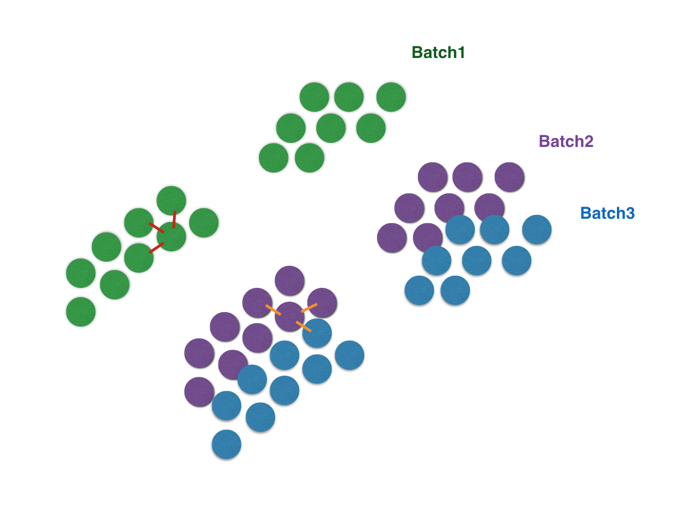

# Batch balanced KNN

BBKNN is a fast and intuitive batch effect removal tool that can be directly used in the [scanpy](https://scanpy.readthedocs.io/en/latest/) workflow. It serves as an alternative to `scanpy.pp.neighbors()`, with both functions creating a neighbour graph for subsequent use in clustering, pseudotime and UMAP visualisation. The standard approach begins by identifying the k nearest neighbours for each individual cell across the entire data structure, with the candidates being subsequently transformed to exponentially related connectivities before serving as the basis for further analyses. If technical artifacts (be they because of differing data acquisition technologies, protocol alterations or even particularly severe operator effects) are present in the data, they will make it challenging to link corresponding cell types across different batches.

<p align="center"></p>

As such, BBKNN actively combats this effect by taking each cell and identifying a (smaller) k nearest neighbours in each batch separately, rather than the dataset as a whole. These nearest neighbours for each batch are then merged into a final neighbour list for the cell. This helps create connections between analogous cells in different batches without altering the counts or PCA space.

<p align="center"></p>

## Citation

If you use BBKNN in your work, please cite the [paper](https://doi.org/10.1093/bioinformatics/btz625):

	@article{polanski2019bbknn,
	  title={BBKNN: Fast Batch Alignment of Single Cell Transcriptomes},
	  author={Pola{\'n}ski, Krzysztof and Young, Matthew D and Miao, Zhichao and Meyer, Kerstin B and Teichmann, Sarah A and Park, Jong-Eun},
	  doi={10.1093/bioinformatics/btz625},
	  journal={Bioinformatics},
	  year={2019}
	}

## Installation

BBKNN depends on Cython, numpy, scipy, annoy, pynndescent, umap-learn and scikit-learn. The package is available on pip and conda, and can be easily installed as follows:

```bash
pip3 install bbknn
```

or

```bash
conda install -c bioconda bbknn
```

BBKNN can also make use of faiss. Consult the [official installation instructions](https://github.com/facebookresearch/faiss/blob/master/INSTALL.md), the easiest way to get it is via conda.

## Usage and Documentation

BBKNN has the option to immediately slot into the spot occupied by `scanpy.neighbors()` in the [Seurat-inspired scanpy workflow](https://nbviewer.jupyter.org/github/theislab/scanpy_usage/blob/master/170505_seurat/seurat.ipynb). It computes a batch aligned variant of the neighbourhood graph, with its uses within scanpy including clustering, diffusion map pseudotime inference and UMAP visualisation. The basic syntax to run BBKNN on scanpy's AnnData object (with PCA computed via `scanpy.tl.pca()`) is as follows:

```python3
import bbknn

bbknn.bbknn(adata)
```

You can provide which `adata.obs` column to use for batch discrimination via the `batch_key` parameter. This defaults to `'batch'`, which is created by scanpy when you merge multiple AnnData objects (e.g. if you were to import multiple samples separately and then concatenate them).

Integration can be improved by using ridge regression on both a technical effect and a biological grouping prior to BBKNN, following a workflow from [Park _et al._, 2020](https://science.sciencemag.org/content/367/6480/eaay3224.abstract). In the event of not having a biological grouping at hand, a coarse clustering obtained from a BBKNN-corrected graph can be used in its place. This creates the following basic workflow syntax:

```python3
import bbknn
import scanpy

bbknn.bbknn(adata)
scanpy.tl.leiden(adata)
bbknn.ridge_regression(adata, batch_key=['batch'], confounder_key=['leiden'])
scanpy.tl.pca(adata)
bbknn.bbknn(adata)
```

Alternately, you can just provide a PCA matrix with cells as rows and a matching vector of batch assignments for each of the cells and call BBKNN as follows (with `connectivities` being the primary graph output of interest):

```python3
import bbknn.matrix

distances, connectivities, parameters = bbknn.matrix.bbknn(pca_matrix, batch_list)
```

An HTML render of the BBKNN function docstring, detailing all the parameters, can be accessed at [ReadTheDocs](https://bbknn.readthedocs.io/en/latest/). BBKNN use, along with using ridge regression to improve the integration, is shown in a [demonstration notebook](https://nbviewer.jupyter.org/github/Teichlab/bbknn/blob/master/examples/demo.ipynb).

## BBKNN in R

At this point, there is no plan to create a BBKNN R package. However, it can be ran quite easily via reticulate. Using the base functions is the same as in python. If you're in possession of a PCA matrix and a batch assignment vector and want to get UMAP coordinates out of it, you can use the following code snippet to do so. The weird PCA computation part and replacing it with your original values is unfortunately necessary due to how AnnData innards operate from a reticulate level. Provide your python path in `use_python()`

```R
library(reticulate)
use_python("/usr/bin/python3")

anndata = import("anndata",convert=FALSE)
bbknn = import("bbknn", convert=FALSE)
sc = import("scanpy",convert=FALSE)

adata = anndata$AnnData(X=pca, obs=batch)
sc$tl$pca(adata)
adata$obsm$X_pca = pca
bbknn$bbknn(adata,batch_key=0)
sc$tl$umap(adata)
umap = py_to_r(adata$obsm[["X_umap"]])
```

If you wish to change any integer arguments (such as `neighbors_within_batch`), you'll have to `as.integer()` the value so python understands it as an integer.

When testing locally, faiss refused to work when BBKNN was reticulated. As such, provide `use_faiss=FALSE` to the BBKNN call if you run into this problem.

## Example Notebooks

**[demo.ipynb](https://nbviewer.jupyter.org/github/Teichlab/bbknn/blob/master/examples/demo.ipynb) is the main demonstration, applying BBKNN to some pancreas data with a batch effect. The notebook also uses ridge regression to improve the integration.** 

The [BBKNN paper](https://doi.org/10.1093/bioinformatics/btz625) makes use of the following analyses:
- [simulation.ipynb](https://nbviewer.jupyter.org/github/Teichlab/bbknn/blob/master/examples/simulation.ipynb) applies BBKNN to simulated data with a known ground truth, and demonstrates the utility of graph trimming by introducing an unrelated cell population. This simulated data is then used to benchmark BBKNN against mnnCorrect, CCA, Scanorama and Harmony in [benchmark.ipynb](https://nbviewer.jupyter.org/github/Teichlab/bbknn/blob/master/examples/benchmark.ipynb), and then finish off with a benchmarking of a BBKNN variant reluctant to work within R/reticulate and visualise the findings in  [benchmark2.ipynb](https://nbviewer.jupyter.org/github/Teichlab/bbknn/blob/master/examples/benchmark2.ipynb). [benchmark3-new-R-methods.ipynb](https://nbviewer.jupyter.org/github/Teichlab/bbknn/blob/master/examples/benchmark3-new-R-methods.ipynb) adds some newer R approaches to the benchmark.
- [mouse.ipynb](https://nbviewer.jupyter.org/github/Teichlab/bbknn/blob/master/examples/mouse.ipynb) runs a collection of murine atlases through BBKNN. [mouse-harmony.ipynb](https://nbviewer.jupyter.org/github/Teichlab/bbknn/blob/master/examples/mouse-harmony.ipynb) applies Harmony to the same data.

The [BBKNN preprint](https://www.biorxiv.org/content/early/2018/08/22/397042) performed some additional analyses that got left out of the final manuscript. Archival notebooks are stored in a [separate repository](https://github.com/Teichlab/bbknn_preprint).